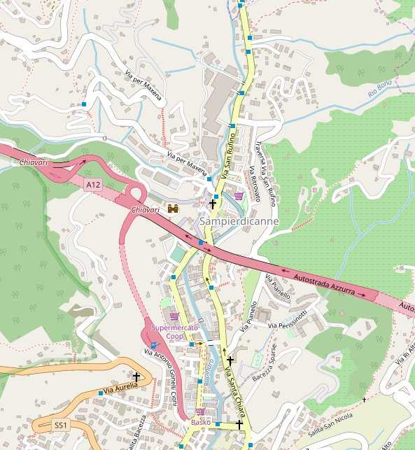

### :phone: Recapiti

- Cellulare: **328.20.12.672**, disponibile anche su <a href="https://t.me/macerie5" target="_blank" title="Telegram">Telegram</a> o <a href="https://wa.me/393282012672" target="_blank" title="Whatsapp">Whatsapp</a>
- Sede: **0185.300.888** (numero VOIP: la chiamata è deviata a cellulare, per cui rispondiamo subito o riceviamo un messaggio vocale)
- E-mail: <a href="mailto:info+web@verderam.com">info@verderam.com</a>


### :earth_africa: Dove siamo
<ul>
  <li><a href="https://goo.gl/maps/TpXAxfntzStcx3Zn8" data-no-instant target="_blank" title="Visualizza la mappa ed ottieni indicazioni stradali">Via Primo Maggio, 16 - 16040 Leivi (GE)</a></li>
  <li><a href="https://goo.gl/maps/yxUfHdUPh8qrvbZCA" data-no-instant target="_blank" title="Visualizza la mappa ed ottieni indicazioni stradali">Via S. Terenziano, 18 - 16040 Leivi (GE)</a></li>
</ul>
<p>
  A [questo link](#) è possibile scaricare una mappa completa di tutti gli appezzamenti. Il file, in formato <a href="https://developers.google.com/kml/?gl=IT&hl=it" target="_blank">KML</a>, può essere visualizzato ad esempio con <a href="https://www.qgis.org" target="_blank">QGIS</a> o <a href="https://earth.google.com" target="_blank">Google Earth(R)</a>.
</p>
La sede legale di VerdeRAM è a <a href="http://www.comune.lavagna.ge.it" target="_blank" title="Sito istituzionale del Comune di Lavagna">**Lavagna**</a>, ma quasi tutte le attività si svolgono in campo o nei fabbricati ad uso strumentale presenti in azienda a <a href="http://www.comune.leivi.ge.it" target="_blank" title="Sito istituzionale del Comune di Leivi">**Leivi**</a>
o a <a href="http://www.comune.chiavari.ge.it" target="_blank" title="Sito istituzionale del Comune di Chiavari">**Chiavari**</a>.

<div class="note">
  <h5>
  :heavy_exclamation_mark: 
    <small class="b i">Disclaimer: sa di <a href="https://youtu.be/ytHHRj545FE" target="_blank">accoglienza tipica ligure</a>, ma un po' è causa di forza maggiore, eh :)</small>
  </h5> 
  <b>Attenzione</b>: l'azienda ha più appezzamenti e putroppo non possiamo essere sempre dappertutto. Nei campi, inoltre, il campanello non c'è ancora ;). <br />La cosa migliore da fare, perciò, è <b>telefonare</b> con un preavviso anche di pochi minuti al numero <a class="b" href="tel:+393282012672">328.20.12.672</a>, così ci troveremo di sicuro.<br />
  <b>Grazie.</b>
</div>

### :tractor: Come raggiungerci

###### Con i mezzi pubblici
Per quanto sparsa sul territorio, VerdeRAM affaccia quasi ovunque sulla strada principale e davanti ai fabbricati di Via I Maggio e di Via San Terenziano a Leivi c'è una <b>fermata dell'autobus</b>. Gli <b>orari</b> possono essere consultati sul sito di <a href="https://www.atpesercizio.it/cartina.php" target="_blank">ATP Esercizio</a>.
<ul>
  <li>
    Orari per **Via San Terenziano**: <a href="https://www.atpesercizio.it/Orari201908091602/orari_TC/3_13_31_A_R_fer.pdf" target="_blank" title="Orario autobus feriale">feriale</a> 
    e <a href="https://www.atpesercizio.it/Orari201908091602/orari_TC/3_13_31_A_R_fes.pdf" target="_blank" title="Orario autobus festivo">festivo</a>.
  </li>
</ul>
La <a href="https://www.trenitalia.com/" target="_blank" title="Trenitalia - Orari">stazione ferroviaria</a> più vicina è quella di **Chiavari**;
<a href="https://www.portsofgenova.com" target="_blank" title="Autorità di sistema Portuale del Mar Ligure Occidentale">porto</a> ed 
<a href="https://www.airport.genova.it" target="_blank" title="Aeroporto di Genova">aeroporto</a> sono a **Genova**.

###### Con auto e mezzi pesanti

Si raccomanda l'uscita di **Chiavari** dell'autostrada A12, quindi di proseguire in direzione **Sampierdicanne** ed infine - a seconda dei casi - salire verso la Scuola elementare di <a href="https://goo.gl/maps/TpXAxfntzStcx3Zn8" data-no-instant target="_blank" title="Visualizza la mappa ed ottieni indicazioni stradali">Leivi</a> o gli insediamenti produttivi di <a href="https://goo.gl/maps/yxUfHdUPh8qrvbZCA" data-no-instant target="_blank" title="Visualizza la mappa ed ottieni indicazioni stradali">San Terenziano</a>. <br />
<figure class="ac">
<a href="https://osm.org/go/xX2DuMqU--?m=" target="_blank" title="clicca sull'immagine per visualizzare la cartina stradale">
  
  </a>
</figure>
<p class="ac">
<small>
  <a href="https://en.wikipedia.org/wiki/Geo_URI_scheme" target="_blank">GEO</a> URL: <a href="geo:44.3533,9.3094?z=15" target="_blank">geo:44.3533,9.3094?z=15</a> e <a href="geo:44.34254,9.31790?z=17" target="_blank">geo:44.34254,9.31790?z=17</a>
  </small>
</p>


<!-- 
### :clock9: Orari

L'intenzione è quella di allinearci al sole ed ai ritmi di un tempo, per cui quando c'è luce tendenzialmente dovremmo essere in campo: molto più a lungo d'estate ed assai meno in inverno, quindi. 
-->
### :pencil: Dati fiscali completi  
Se sei un cliente o un fornitore può esserti comodo avere a portata di mano tutti i dati fiscali dell'azienda. 

```
​VerdeRAM di Valerio Sanguineti
C.so Genova, 83 int. 29
16033 LAVAGNA (GE)

Partita I.V.A...: 01119310991 
Codice Fiscale..: SNGVLR77S09C621C 
R.E.A...........: GE - 486153
Cod. dest. SDI..: N92GLON
```

<p class="ar">
  <small>
  [Inizio pagina](#)
  </small>
</p>
<!-- https://laurakalbag.com/processing-responsive-images-with-hugo/ -->
